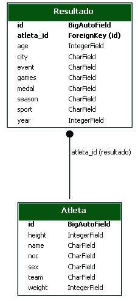

# API de Resultado de Atletas - (dados do Kaggle)
- API disponível em: https://atletas-kaggle.herokuapp.com
- Documentações
- - Swagger: https://atletas-kaggle.herokuapp.com/swagger/
- - Redoc: https://atletas-kaggle.herokuapp.com/redoc/
### Objetivo:

A partir de um csv disponibilizado na plataforma Kaggle, gerar uma API Rest.
Fonte de dados: https://www.kaggle.com/datasets/heesoo37/120-years-of-olympic-history-athletes-and-results

### Metodologia:

- Testes unitários
- Stack: Python, Django Rest Framework, GitHub, Heroku

### Diagrama de modelo de dados:
- Modelos de dados: Atletas, Resultados



### Features disponíveis:

- Rotina para preencher banco de dados
- Validadores de entrada de dados
- Navegação por hiperlink.
- Filtro de campos
 
---

## 🚀 Começando

Essas instruções permitirão que você obtenha uma cópia do projeto em operação na sua máquina local.

### 🔧 Instalação


Clone o repositório:

```
git clone https://github.com/yurikfernandes/atletas_kaggle.git
```

1. Entre no diretorio

```
cd atletas_kaggle
```

2. Inicialize um ambiente virtual:

```
python3 -m venv venv
```

3. Ative o ambiente virtual:

Para Unix ou MacOS:
```
source venv/bin/activate
```
Para Windows (no powershell):
```
venv\Scripts\activate.ps1
```


4. Instale as bibliotecas necessárias usando o arquivo requirement.txt

```
pip install -r requirements.txt
```

5. Entre na pasta do projeto django:

```
cd setup
```

6. Adicione no diretório principal um arquivo '.env' com a definição da SECRET_KEY do projeto. *A string vai será usada somente pra encriptação de processos do django, por isso você mesmo pode definí-la.*

Conteúdo:
```
SECRET_KEY = 'string_aleatoria'
```


7. Faça as migrações necessárias:
```
python3 manage.py migrate --run-syncdb
python3 manage.py makemigrations
```

7. Preencha o banco de dados com o script seed.py.

*Esse processo pode demorar a depender da configuração do seu computador.*

```
python3 seed.py
```

8. Inicialize a aplicação
```
python3 manage.py runserver
```